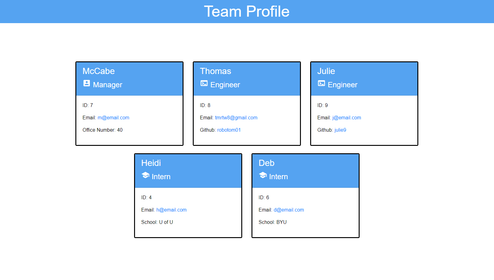

# Team Project Generator  
  I WANT to generate a webpage that displays my team's basic info.  Tool using node.js and additional plugins to generate a website for a company's team profile.  After initiating, `inquirer` will walk the user through a series of questions in the terminal to build their team profile.  [Example Video](https://watch.screencastify.com/v/r1aImDLb1BZkBZ0uOVIJ) 
   
  

  ---
  ## Contents

  1. [Installation](#installation)
  2. [License](#license)
  3. [Tests](#tests)
  4. [Contact](#contact)

  ---

  ## Installation:
  Git clone.  Tool runs in local terminal so you can execute the commands and functions there to produce a local file set for your site.
  

  ---

  ## License
   

  ---

  ## Tests:
  Uses `jest` 
  Enter `npm test` in the repository terminal. 

  ---

  ## Contact Information:
  * GitHub Username: RoboTom01
  * Email: tmrtw8@gmail.com  
  
  